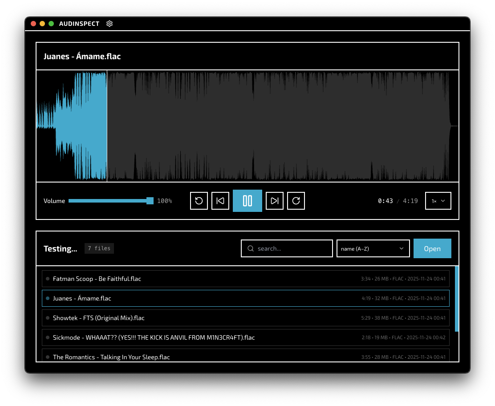

# Audinspect

An audio inspector. Made for quick viewing of audio files. Built with Electron + React and wavesurfer.js



## Features

- Audio scrubbing
- Waveform view
- Quick audio file viewing
- Drag and drop
- Sorting
- Searching
- Metadata viewing
- Volume control
- Speed control
- Interface customization (including waveform, accent color, etc)

## Who is this for?

This is for music producers, A&R Teams, labels, reviewers, and people who want to quickly inspect music.

FFmpeg and ffprobe are included for conveience. In the future we will include an option to specify a custom FFmpeg/ffprobe path, although we don't think it will be necessary.

## Getting Started with Developing

Install all dependencies:

```bash
[npm|pnpm|yarn|bun] i
```

Run the app in development mode with hot-reload:

```bash
[npm|pnpm|yarn|bun] run dev
```

Build the React app:

```bash
[npm|pnpm|yarn|bun] run build
```

Build and package the Electron app for distribution:

```bash
[npm|pnpm|yarn|bun] run package
```

## Building on Windows

You will need to install the following to build this app for windows:

- Visual Studio Build Tools
- Python >= 3.11
- node-gyp

To build this app, node-gyp needs minimum VS2019 SDK or above to build with v142 of the following:

- C++ Build Tools for Visual Studio 2019 (x64 and x86)
- C++ Build Tools for Visual Studio 2019 (ARM64)

The build will fail if these components are not installed.

After a successful build, you should see `build/` update with a packaged installer.

If you get a Windows SmartScreen error after launching the executable, click "More info" and then "Run anyway" to continue installation.
